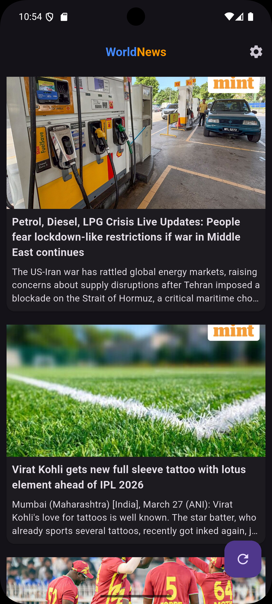
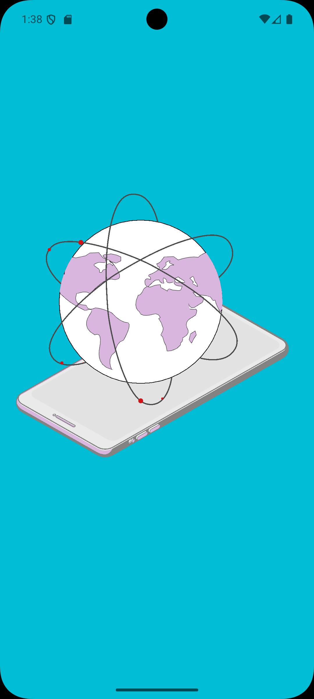
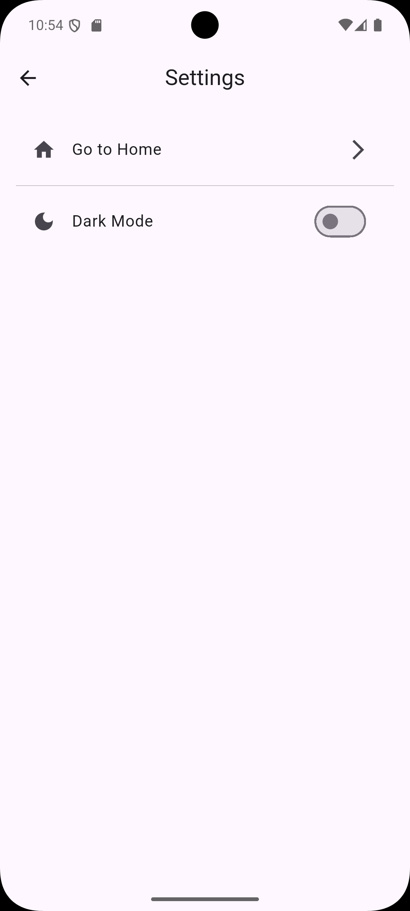
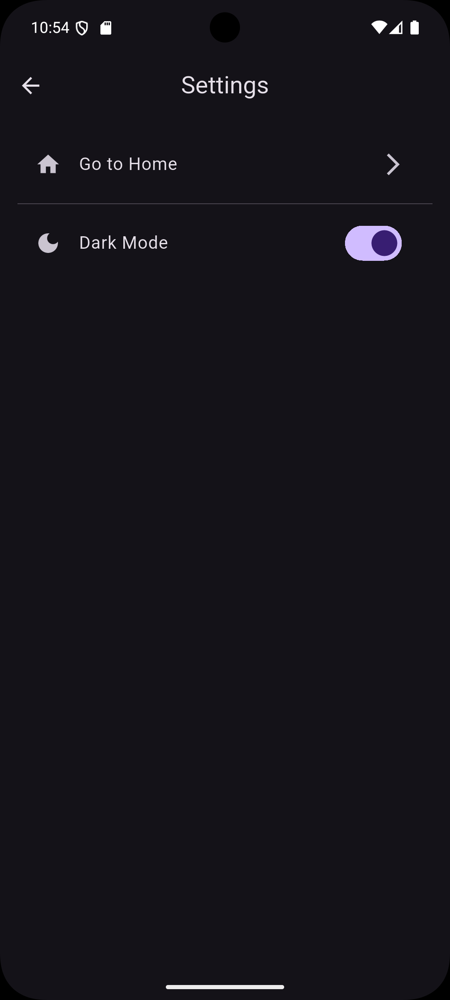

# 📰 World News App (Flutter)

A modern and scalable **Flutter News Application** built using clean architecture principles. This app fetches news from an API and provides a smooth, user-friendly experience with state management, caching, animations, and theming.

---

## 🚀 Features

* 🔗 **News API Integration**

  * Fetch latest news dynamically from API
  * Smooth image loading and error handling

* 💾 **Local Storage (SharedPreferences)**

  * Save user preferences like theme (Light/Dark)
  * Persist app settings

* 🎬 **Lottie Animation**

  * Beautiful animated splash screen
  * Enhances user experience

* 🧠 **State Management (Provider)**

  * Clean and scalable architecture
  * Efficient UI updates

* 🌗 **Dark / Light Theme Toggle**

  * Switch themes using Provider
  * Persistent theme using SharedPreferences

* 🔄 **Refresh Functionality**

  * Floating Action Button (FAB) to refresh news
  * Manual refresh support on Home Screen

* ⚡ **Optimized UI/UX**

  * Fast loading
  * Minimal and clean design

---

## 📱 Screenshots

### 🏠 Home Screen                           <hr>            ### 🌙 Dark Mode
    <hr>      


### 🎬 Splash Screen (Lottie)


---

###  Setting screen (Lottie)


## 🎥 App Demo Video


https://github.com/user-attachments/assets/650ead74-d0b1-43e7-a5d2-3f8a1ade4a2a


---

## 📂 Project Structure

```
lib/
│── providers/         # Provider state management
│── screens/           # UI screens
│── main.dart          # App entry point
```

---

## ⚙️ Packages Used

* `provider` → State Management
* `http` → API Calls
* `shared_preferences` → Local Storage
* `lottie` → Animations

---

## 🛠️ Installation & Setup

1. Clone the repository

```bash
git clone https://github.com/your-username/world-news-app.git
```

2. Navigate to project folder

```bash
cd world-news-app
```

3. Install dependencies

```bash
flutter pub get
```

4. Run the app

```bash
flutter run
```

---

## 📁 Assets Setup

Add your assets in `pubspec.yaml`:

```yaml
flutter:
  assets:
    - assets/
    - videos
    - apk icon
    - lottie
```

---

## 🧩 Future Improvements

* 🔍 Search functionality
* 📌 Bookmark news
* 🌍 Category-wise filtering
* 🔔 Push notifications

---

## 👨‍💻 Developer

**Yogesh Makwana**

* 💼 Flutter Developer
* 🎓 BCA Student (Gujarat University)

---

## ⭐ Support

If you like this project:

* ⭐ Star this repo
* 🍴 Fork it
* 🛠️ Contribute

---

## 📄 License

This project is licensed under the MIT License.

---
